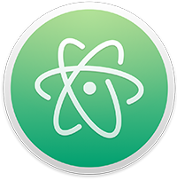
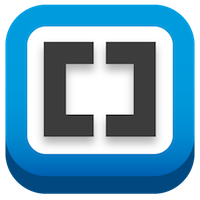
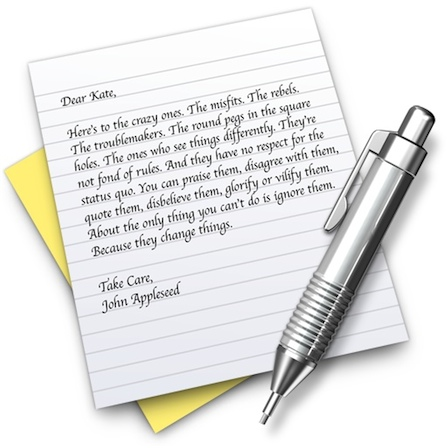

When you are writing HTML you can use a simple text editor to write your HTML but this can be a git of a frustrating experience because it will not show any errors.

Below are some options for better HTML editors. In class we will be using **Atom**. Atom is build by GitHub.

## [Atom](//atom.io/)

Atom is a free and open-source text and source code editor for OS X, Linux, and Windows with support for plug-ins written in Node.js, and embedded Git Control, developed by GitHub. Atom is a desktop application built on web technologies; in other words, it is not an online web application. Most of the extending packages have free software licenses and are community-built and maintained. Atom is based on Electron (formerly known as Atom Shell), a framework that enables cross-platform desktop applications using Chromium and io.js, which is also developed by GitHub. It is written in CoffeeScript and Less. It can also be used as an IDE. Atom was released from beta, as version 1.0, on June 25, 2015. The developers call Atom - 'A hackable text editor for the 21st Century'.

Price: **Free** (open source) 
Requires: OS X 10.8 or later 
Developer: GitHub

---

## [VS Code](https://code.visualstudio.com/)

Visual Studio Code is a source code editor developed by Microsoft for Windows, Linux and macOS. It includes support for debugging, embedded Git control, syntax highlighting, intelligent code completion, snippets, and code refactoring. It is also customizable, so users can change the editor's theme, keyboard shortcuts, and preferences. It is free and open-source, although the official download is under a proprietary license. Visual Studio Code is based on Electron, a framework which is used to deploy Node.js applications for the desktop running on the Blink layout engine.

---

## [Brackets](//brackets.io/)

You may not have known this, but Adobe has a small open source markup editor project called Brackets. It’s available on both Mac and Windows for free and receives updates every 2.5 weeks, according to the developer. There are always new features being added to it, but the current ones include tabbed editing, a fullscreen mode, a very handy live preview, and even a bunch of debugging features if the app has problems. The best part about this free tool is that Adobe wants you to hack it. The company is very supportive of any customization efforts you may have and will even take suggestions for feature integrations in a later release.

If you want your own custom markup editor, this is the best app you’ll get for free. Its possibilities are infinite, and it’s a code editor that actually looks nice.

Price: **Free** (open source) 
Requires: OS X 10.6 or later 
Developer: Adobe

---

## [Sublime Text](//www.sublimetext.com/)

Since 2008, Sublime Text has brought a series of great editing techniques to Mac, Linux, and Windows. It’s a universal “text editor you’ll fall in love with”, says the developer, John Skinner. The tabbed interface is not unlike that of Google Chrome. There’s a side-by-side mode for comparing documents. There’s a fullscreen mode available for concentrating, making it great for writers, too. Its most well-known feature is Goto Anything, which allows you to open files with a few taps on the keyboard, and will also locate any symbols, lines, or words in the document (though the multiple cursors feature might debate that most-well-known status).

Sublime Text is the pinnacle of code editors on the Mac, and it comes with a price tag to match: $70. You can try it for free, though, to find out if this is the experience you desire. And if you try out some of the themes, packages, and more for Sublime Text (just search GitHub for an idea of what you can get), and try some of the Tuts+ tips for it (or take their whole course on Sublime Text), you’ll likely be hooked.

Sublime Text is best for the individual who wants a utility that can edit any type of code imaginable. It’s not just built for the Web developer like most editors, but rather for the virtuoso. Like Brackets, this app has support for extension and lots of customization. There’s even a beta of the next Sublime Text ready to try, as well, if you’re brave and have shelled out for a license already.

Price: **Free to try; $70** 
Requires: OS X 10.6 or later 
Developer: John Skinner

---

## [TextWrangler](//www.barebones.com/products/textwrangler/)

From Bare Bones Software comes one of the most powerful free editors on the market. It’s got side-by-side editing, multi-file search and replace, AppleScript support, FTP and SFTP integration, line collapsing, syntax highlighting for popular codes, OS X scripting support, and more. When compared to our other favorite free editor, though, it falls short in some areas. There is no live preview available and cool little features like Quick View (inline preview for colors) and extensions are not available. Still, it does support things like AppleScript and FTP, which can be incredibly useful. Also, the paid version of this app (BBEdit) has a lot of extra HTML tools.

TextWrangler is good for the individual who delights in having FTP/SFTP transferring support built-in, but doesn’t need any of those fancy preview features. The ideal user is someone who doesn’t use a GUI as much as command line.

Price: **Free** 
Requires: OS X 10.6.8 or later 
Developer: Bare Bones Software

---

## [Coda 2](//panic.com/coda/)

This isn’t a universal editor that’ll work for Objective-C or Ruby once in a while. It’s a workstation for Web developers featuring a customizable user interface, line collapsing, full server communication with S3, FTP, and more, iCloud sync for sites, live hints and completion to help you complete things faster, automatic indentation, and even an integrated MySQL editor. It’s the best of every editor brought into one massive utility — the Web developer’s dream. All of this will cost you the same as Sublime Text, but it does more than just edit markup languages.

If you’re investing in a Web development career, this utility may be the best all-in-one utility to buy. It can make your workflow much more simplified and eliminate the need to switch apps for file transfers. All for the price of the most popular markup editor.

Price: **$74.99** 
Requires: OS X 10.6.6 or later 
Developer: Panic Inc.

---

## Text Edit

In the case that you can't install software you can always use the free editor installed on all MACs. There are two very big draw backs. 1. It is a simple text editor so there is no coloring or errors shown. 2. It takes some steps to set it up.

View this video below to see how to set up text edit to to edit HTML.

Price: **Free** 
Requires: OS X 10.6.6 or later 
Developer: Apple Inc.

<iframe src="//player.vimeo.com/video/71448456?byline=0&amp;portrait=0&amp;color=ff9933" width="100%" height="415" frameborder="0" webkitAllowFullScreen mozallowfullscreen allowFullScreen></iframe>

