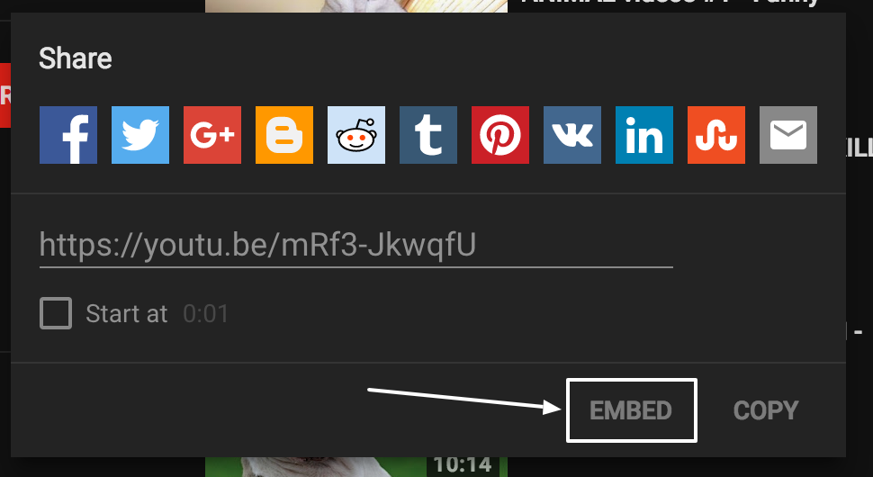
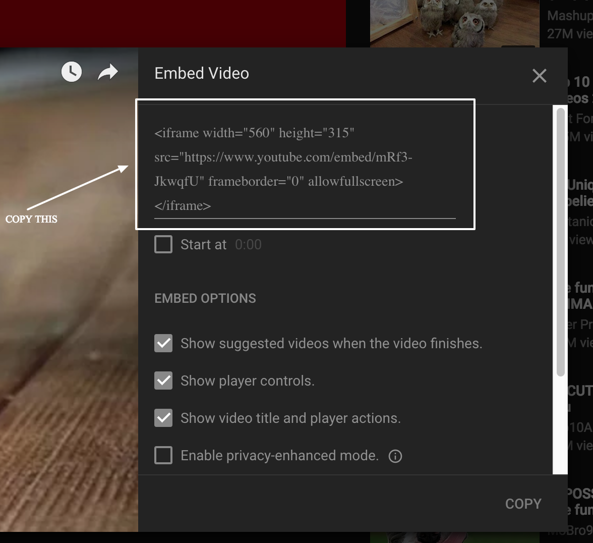
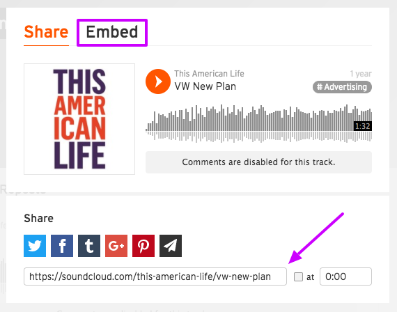

One of the great things about the internet is how it display it is to share content from 3rd party on your web site.

## Steps

1.  Find the content you want to embed
2.  Click the share button
3.  Select embed
4.  Copy code provided
5.  Paste the code in your `html` file

Since each site might have a different design things might be in different places or have different labels but the basic idea are the same.

### YouTube

Step 1


Step 2



Step 3



#### Example

```html
<iframe width="560" height="315" src="https://www.youtube.com/embed/mRf3-JkwqfU" frameborder="0" allowfullscreen></iframe>
```

<iframe width="560" height="315" src="https://www.youtube.com/embed/mRf3-JkwqfU" frameborder="0" allowfullscreen></iframe>

## Soundcloud



```html
<iframe width="100%" height="166" scrolling="no" frameborder="no" src="https://w.soundcloud.com/player/?url=https%3A//api.soundcloud.com/tracks/228094613&amp;color=ff5500&amp;auto_play=false&amp;hide_related=false&amp;show_comments=true&amp;show_user=true&amp;show_reposts=false"></iframe>
```

<iframe width="100%" height="166" scrolling="no" frameborder="no" src="https://w.soundcloud.com/player/?url=https%3A//api.soundcloud.com/tracks/228094613&amp;color=ff5500&amp;auto_play=false&amp;hide_related=false&amp;show_comments=true&amp;show_user=true&amp;show_reposts=false"></iframe>

<style>
article img {
  max-width: 100%;
}

iframe {
  max-width: 100%;
}
</style>
