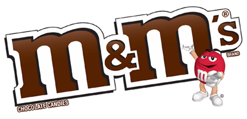

On the web today we use 3 types of images. Each has an advantage and disadvantage over the other types. It is import to use the correct image type in the right situation to ensure fast page loads.

---

## GIF - Graphics Interchange Format

The GIF dates back to 1987 when it was first introduced by CompuServe. GIFs are palette based which can hold up to 256 colors. One of the colors can be transparent. This is not the same as opacity where the color is set to a percentage of the color and you are able to see thought it to the color behind. Instead the GIF format is either a color or transparent. Because of this limitation things like a true drop shadow within an image are not very successful. This is not as much of an issue with the new CSS3 drop-shadow property.

### Animation

One of the great advantage of a GIF is that it can be animated by looping through a number of flat images. This a nice alternative to having to load a full movie because the file size is often much smaller. The image is still limited to 256 colors per frame so the animation may appear to be very pixelated.

When should I use a GIF?

#### Example

Logo, graphics, charts, any image that has less than 256 colors.

---

## JPG

The JPG or JPEG dates back to 1991 and introduced a new way to compress images. By removing the redundant or like pixels the JPG is able to reduce the size of an image. JPGs are often used to reduce the size of a high color image. JPG can not have transparency or animation.
When should I use a JPG?

### Examples

High resolution images, anything that has a gradient or anything with lots of colors. 1

---

## PNG - Portable Network Graphics

The PNG dates back to 1996 but was not supported on the web until the mid 2000. The PNG is a hybrid between the GIF and the JPG because it can supports many colors as well as transparency. Unlike the other formats PNG support opacity making a true drop shadow within the image possible.

---

## SVG - Scalable Vector Graphics

(SVG) is an XML-based vector image format for two-dimensional graphics with support for interactivity and animation. The SVG specification is an open standard developed by the World Wide Web Consortium (W3C) since 1999. SVG images and their behaviors are defined in XML text files.

## Image Resizing

In the event that an image needs to be resized each image type display different. 

## Optimization

Optimizing images is a very import step to ensure that pages load quickly. Images in their default state are often much later than they need to be. While you can control the display size of an image with HTML or CSS it will not change the actual size of the image and you may end up downloading something much larger than you need.
Each image type has its own compression and can reduce the image by a lot. It is important to choose the correct image type for its need. Just because it is small size it may not display correct and will look wrong.

