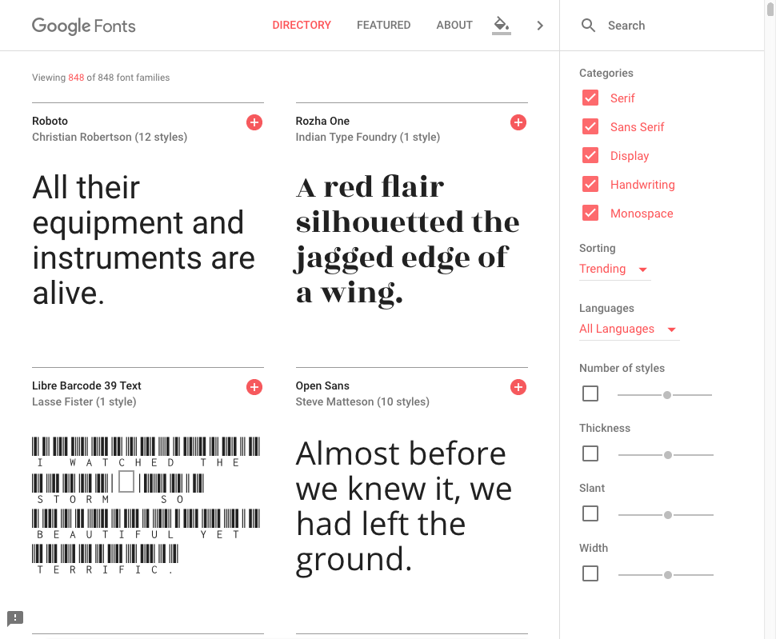
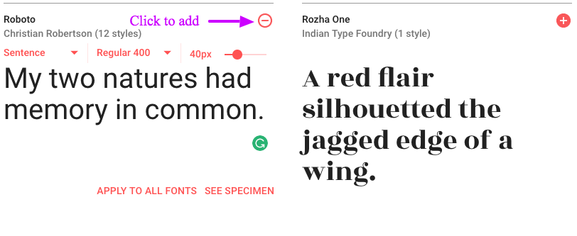
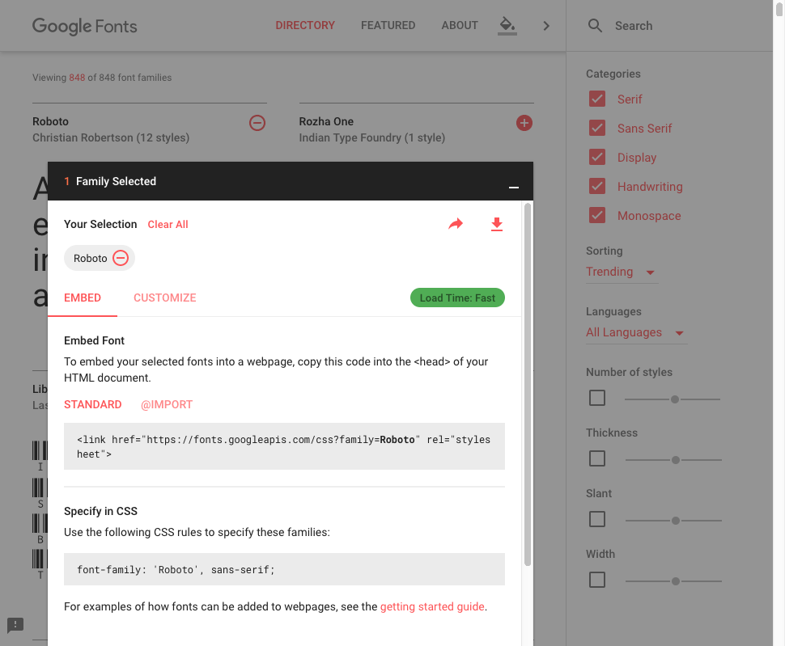
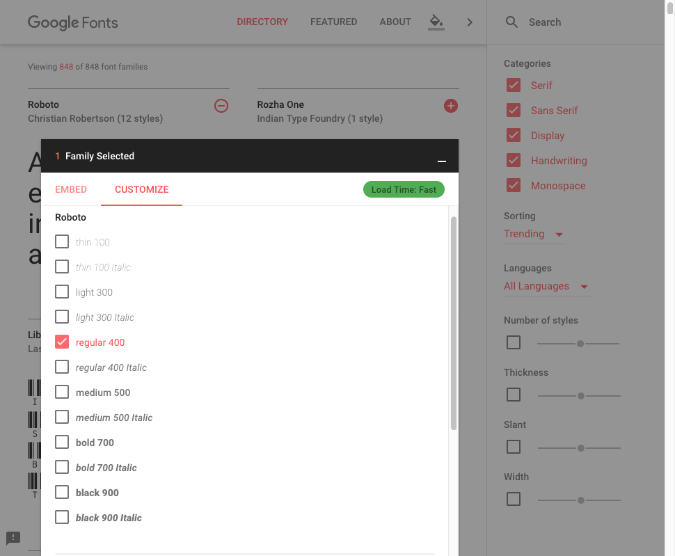
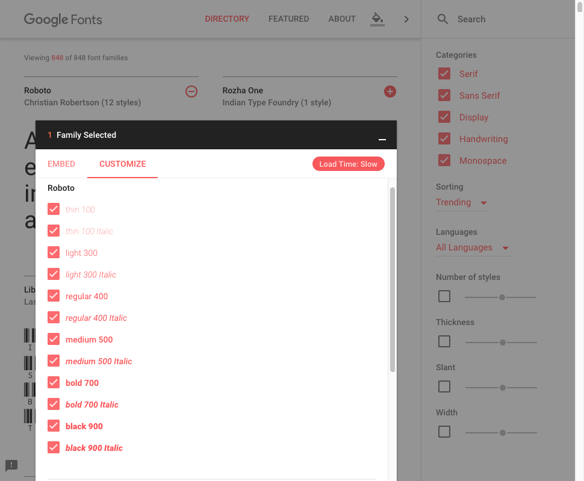
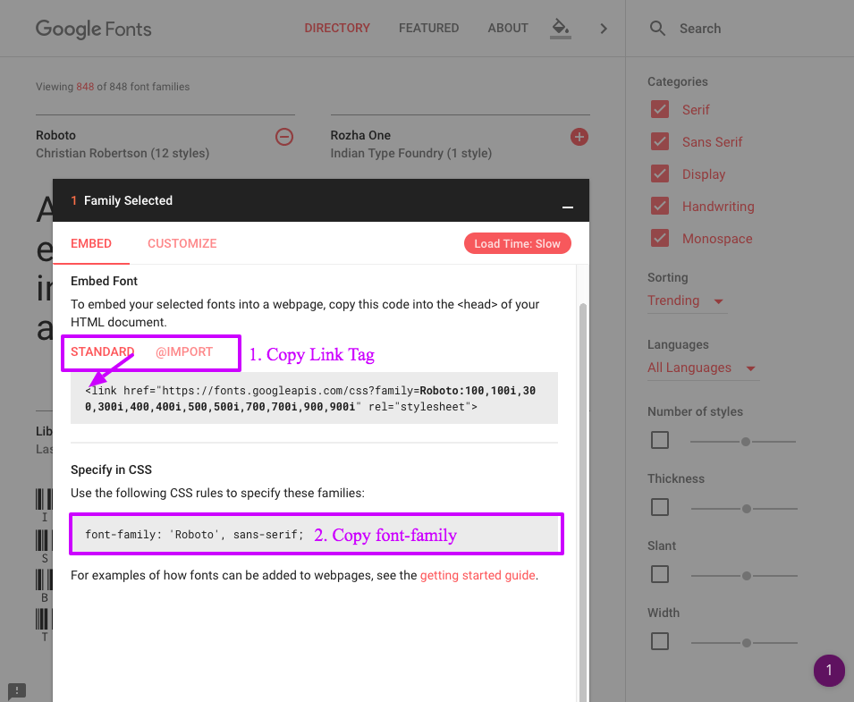

## Introduction

One of the advantages of using Google Fonts is it is free to use and offers a wide range of fonts. You will need just add a little code to your html and css to get the fonts to display. Since we are using a 3rd party to load the fonts there could be a performance hit. When you use a Google Font and load your page the browser will need to go and download any resource to your local cache while this is happening the fonts you want to use can not display.

What they will send you.

```css
@font-face {
  font-family: "Awesome Font";
  font-style: normal;
  font-weight: 400;
  src: local("Awesome Font"), url("/fonts/awesome.woff2") format("woff2"), url("/fonts/awesome.woff")
      format("woff"), url("/fonts/awesome.ttf") format("truetype"), url("/fonts/awesome.eot")
      format("embedded-opentype");
}

@font-face {
  font-family: "Awesome Font";
  font-style: italic;
  font-weight: 400;
  src: local("Awesome Font Italic"),
    url("/fonts/awesome-i.woff2") format("woff2"), url("/fonts/awesome-i.woff")
      format("woff"), url("/fonts/awesome-i.ttf") format("truetype"), url("/fonts/awesome-i.eot")
      format("embedded-opentype");
}
```

Since each case of a font is its own file the more variations of the file you use will need to loaded. This can add up and slow down the loading of your site. Try to limit the number of web fonts because of this.

## Getting started

1.  Load the [Google Fonts](https://fonts.google.com) site.
2.  Select the font(s) you want to use.
3.  Add fonts to your site
4.  Add `font-family` to the element(s) you want style.

### Load site



### Select Font Family

You can select as many as your want but make sure what ever font you select you use. You don't want to download a file that is not used.



### Click the Family Selected Black Bar at the bottom

This will bring up a dialog that you can use to customize your fonts.





Notice the "Load Time Fast/Slow" in the top right of the dialog. It warns you if you changes will take a long time to load. You want this to be green. Remove any font that you will not use.



### Add font to your project

Once you have it customize the way you want you will now need to add the code to your project. This is done in two parts.

1.  Add the CSS to your site. (`<link>` or `@import`)
2.  Add the `font-family` to your selector



#### Link Tag

```html
  <title>project title</title>
  <link href="https://fonts.googleapis.com/css?family=Rozha+One" rel="stylesheet">
  <link rel="stylesheet" href="site.css">
```

#### @import

If you want to add the font to a css file you can use `@import` as the first line of your css file.

```css
@import url("https://fonts.googleapis.com/css?family=Rozha+One");
body {
  margin: 0;
  font: 16px arial;
}
```

<h3 class="example">Add fonts to your styles</h3>

Once you have the fonts added to your project you still need to add them to the styles that you want to use them. Any Selector an use a Google Font.

```css
h2 {
  font-family: "Rozha One", serif;
  color: #663399;
  text-transform: uppercase;
}
```

At this point the `font-family` is just like using `arial` or any other font-family. You can use any other styles you need for your designs.
