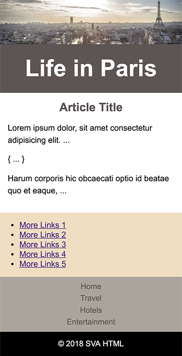

In this homework we will be working adding

* responsive image
* media queries

Download the starter file.  In there will be the finish "desktop" view you will need to update the page to display for a device that is `414px`.

## What you need to do

* Create a media query that has a max with of `414`
* Change the `.row` so it displays a "column"
* Change the `.global-nav` flex box to be "column" (hint find the *flex parent*).
* Set the `.primary-header` to `1.5em`
* Make `.global-footer` text align to the center
* Make `.global-nav`'s link font size `1em` and have no border
* `.content-area h2` text should be in the center.

## Change the order

We need to change the order to the content displays in this order

1. `.banner`
2. `.primary-header`
3. `.row`
4. `.global-nav`

## Add a picture tag

In the HTML file find the `.banner` element and use the `<picture>` tag to change to pull the `small` image at `414px`.

---

