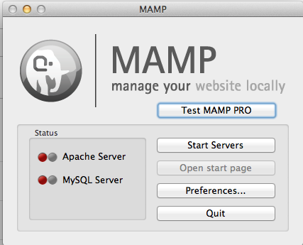
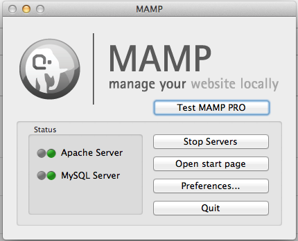

How to set up your own HTML website including how to choose where to host and how to upload.

## Building a full site

**The magic of the index.html**

When building a site that is hosted on a web server there needs to be a default file to serve. In most cases this is **index.html**. When you have a folder and put only one file in that folder it should be index.html since it will be served by just requesting the site or any subfolder of that site.

For example you may go to a site named http://www.svahtml.com but you just ask for the site you never say what file you want. The server knows to give you the default file, index.html. to make life easy it just gives you it and the file is never displayed in the URL. But what happens when you go to a sub folder like? Again you are not saying what file you want so the server needs to give you the default file which is index.html.

So far we have two files in two folders each named **index.html**. For every folder that we have on the site it will have it&#39;s own index.html. As you might imagine there could be a lot of index.htmls.

Because of this we need to be very careful about the file we are working on. One way to help keep track of the file that you are editing it is very useful to update the for each page on your site. It might be something like this.

- For you homepage - Site Name | Home
- A sub folder for your gallery might be - Site Name | Gallery

This way you can look at the markup to know what page you are on.

It should also be noted that you can not replace one index with an other since all the links where set for that page and the content would be wrong.

## Your site might be something like this

    Homepage
    - News
    - Sport
    - Weather
    - Gallery

Every subsection on your site should be broken into its own folder.

    /index.html
    /news/index.html
    /sports/index.html
    /weather/index.html
    /gallery/index.html

We have 5 index.html files.

## But what if we have to have more than one file In a folder?

In that case any other file can be named whatever you want. It would be linked to from the index.html using the link tag **(href=&rdquo;filename.html&rdquo;)**.

## For example

    /news/index.html
    /news/yesterday.html
    /news/breakingnews.html
    /news/fun-stories.html

In this example we have four files all in the **/news/** folder.

When you have your files on a web server you are able to use absolute paths to make the paths from one section or folder to another.

If you wanted to link from the news page to the weather page there are two ways to do this.

1.  Use a relative path. **../weather/**
2.  Use an absolute path **/weather/**

The reason option 2 is better is because it will be the same path for all files on the site regardless of where you are.

## Dev Local

The big problem with this way is it will not work when viewing your files from a local directory.

If you want to still develop locally you will need to set up a local server. One great one is MAMP. it is very easy to setup and use and will allow you to have the same setup as your web server.

You just need to set the &ldquo;Document Root&rdquo; by clicking the Preferences button then clicking Apache.

Then set the folder of your project and click OK.

Once that is done you need to click Start Servers. It may ask you to enter your username and password. In almost all cases this will be the same as when you logged in to the computer.

if everything works your app will have two green lights

Then you need to go to http://localhost:8888/

This will act as a real web server but you can continue to develop locally.
