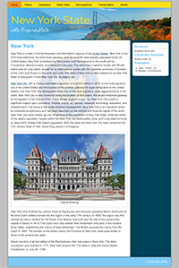

This week we work on the in class final.

<span class="more"></span>

## Getting Started

The final project is open book, meaning you can use any resource you need to finish the project including asking any questions you have. The final is a multipage microsite.

The final is due at 9:30 on August 1, 2018. Please email a zip file to dan@svahtml.com.

**You are required to only code the desktop version** however if you have time or want a challenge you the is a mobile version.

### PSD

[](summer.psd)

## Colors

There are a limited number of colors that are used in the design you can copy the **Hex** color below and use in your css.

> You can click on a color to copy to your clipboard

- \#c0c0c0
- \#333333
- \#004358
- \#50b7f1
- \#ffe11a
- \#ff951a
- \#ffffff
- \#b7b7b7
- \#7fcaf5

## Header Content

<pre class="text-content">
New York State
The Empire State
</pre>

## Nav Content

<pre class="text-content">
Home => index.html
History => history/index.html
Geography => #
Major cities => #
Demographics => #
Transportation => #
Sports => #
</pre>

## Sizes

While I will not give you the sizes for the padding or margin they will always we defined in `em` and be a whole number value like `1em`;

### Font Sizes

For the body use

```css
font: 16px arial;
```

### Headline Sizes

Header Title

```css
font-size: 60px;
```

Header tagline

```css
font-size: 20px;
```

article h2

```css
font-size: 3em;
```

article h3

```css
font-size: 2em;
```

sidebar headline

```css
font-size: 1.5em;
```

sidebar box

```css
font-size: 14px;
```

## Copy

The copy for the final project can be found in the PDF. Note the copy in the PDF may not match the PSD in this case the PDF is correct.

### PDF

- [Copy for final](./final/final-content.pdf)

## Images

All the images for the project can be found in the zip file

### ZIP

- [Images](./final/images.zip)

## Google Fonts

The project uses a few Google Fonts. Add this code to your HTML file.

```html
<link rel="stylesheet" href="http://fonts.googleapis.com/css?family=Homemade+Apple|Montserrat">
```

### Font-family

```css
font-family: "Montserrat", sans-serif;
font-family: "Homemade Apple", cursive;
```

### Example

<h2 style="font-family: 'Montserrat', sans-serif">font-family: 'Montserrat', sans-serif;</h2>

<h2 style="font-family: 'Homemade Apple', cursive">font-family: 'Homemade Apple', cursive;</h2>
