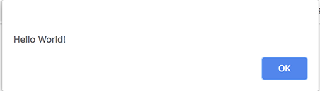
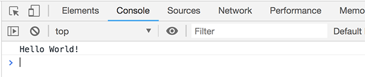

This week we will start to talk about JavaScript and how we can use it on our pages.

<span class="more"></span>

## What is JavaScript?

JavaScript or JS is a scripting language that can be run within a web browser.  JavaScript is an interpreted language meaning it is able to run directly in a browser with out having to be transformed.  This makes it very easy to start learning JS we dont need any special tools to get it to run.

## Getting started

One of the hardest thing about JS is just getting starting since JS can do so much its hard to know where to start or even how to see your JS code run.

### Adding script to your HTML file

Link css JavaScript can be run from the HTML page by adding a `<script>` or you can create an external file and include it in your file.

```html
<script>
alert("hello world");
</script>
```

or adding an external file.  You will need to create a new file with a `.js` file type.

```html
<script src="path/to/file.js"></script>
```

**Note:** that in both case you are using the `<script>`;

### View JS

As we go on we will learn ways to update the html elements but for now we need an easy way to view and interact with JavaScript.

The most basic way we can see the out put of JavaScript is to use an `alert()` this is a built in method that will display a prompt with a value.

```html
<script>
alert("hello world");
</script>
```



While this works there are number of things that make it hard to work with.

1. it blocks the loading for the page.
2. it can only display one thing at at time
3. you can not interact with it or debug from it.

Because of all of these things plus a few more the alert is not how we want to work with JavaScript.

### console.log

All browser have development tools and one of the development tools is a console.  Within our JS code at any point we can write a value to the `console.log`.

```html
<script>
console.log("hello world");
</script>
```

To view the console you need to open the developer tools by right clicking and select "inspect element" then choose the "Console" tab.



The console can do many things

1. view anything written the log using `console.log`
2. run JS code
3. help debug your code.
4. display any error that happen in your code.

We will be using the console to help learn JS but it should never be used in any final or production code it is just a tool.  Normal users would never look at the console.

## JS versions

There have been a number of JavaScript today we can use ES8 but most older bowers like IE11 only run ES5.